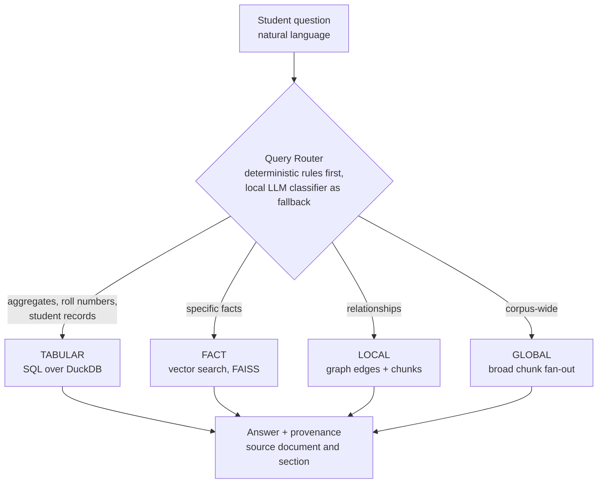

# Company Brain

**Your college's answers, in your pocket — running on your phone.**

A student asks *"do I have a backlog in DBMS?"*, *"am I eligible for the scholarship?"*,
*"what's the minimum attendance?"* — in their own words. Four kinds of question route to
four different retrievers: **SQL for numbers, vector search for facts, a graph for
relationships, corpus-wide fan-out for overall questions.**

> **The engine is built, benchmarked, and beats two rival architectures on the same hardware.
> The 30 hours puts it on the phone's silicon.**

Submitted to the **iQOO Hackathon — Smart Education** track.
Long-form submission narrative: **[`docs/IQOO_SUBMISSION.md`](docs/IQOO_SUBMISSION.md)**.

<p>


</p>

---

## The problem

A student's own record is the one document they cannot get an answer out of. Today that
answer arrives as a WhatsApp rumour, a queue outside the admin office, or a photo of a
notice board taken by whoever got there first.

The institution **already has** every one of those answers — in a results PDF, a fee sheet,
a policy circular. It is not reachable from where the student is standing. There are
roughly **43,000 colleges and ~4 crore students** in Indian higher education (public
figures, not our measurement), nearly all of them carrying a phone, almost none with an app
that answers a question about their own record.

Cloud-first attempts die in the registrar's office. Student records are PII, frequently
minors' PII, and no college will paste a results database into a cloud LLM. **That is exactly
why the answer engine runs on the device** — and why we built to a 4 GB budget from day one,
before the phone was ever on the table.

---

## The numbers

Same corpus, same 4B local model (`qwen3:4b-instruct-2507-q4_K_M`), same 4 GB GPU
(RTX 2050), same frozen scorer — **208 questions**:

| Architecture | Overall | FACT (97) | GLOBAL (57) | LOCAL (54) |
|---|---|---|---|---|
| Naive RAG — top-3 chunks, no routing | 62.5% | 88 | 34 | **8** |
| GraphRAG-style — community summaries + graph edges | 69.7% | 94 | 20 | 31 |
| **This system** — routed, chunk fan-out + hybrid graph | **88.9%** | **95** | **46** | **44** |

**+26.4 points over naive RAG.** On multi-hop relational questions — the ones that need a
second document to answer — **8/54 → 44/54, a 5.5× improvement**.

| Also measured | |
|---|---|
| Abstains correctly on unanswerable questions | **20/20** — it does not invent an answer |
| Tabular accuracy on the real corpus | **21/22 (95.5%)** — exact figures, via SQL |
| Median end-to-end latency | **1.85 s** on a 4 GB laptop GPU |
| Artifact floor (a content-free answer) | 19.2% — our score is **4.6×** that |
| Automated tests | **280 passing**, 50 files |
| Cloud calls | **zero**, enforced by a test, not by a policy document |
| Real data behind it | **369 students · 2,952 exam records · 12 policy documents** |

Every figure is reproducible from this repo — see
[Reproducing the benchmark](#reproducing-the-benchmark). Full methodology, the experiments our
own gates rejected, and the exact boundary of what we have measured:
**[`docs/PITCH_METRICS.md`](docs/PITCH_METRICS.md)**.

---

## Shipped · Next 30 hours

Two columns of achievement. The left one is measured today; the right one is what the
hackathon puts on the device.

### Shipped and measured

| Component | Evidence |
|---|---|
| Four-route retrieval engine + router + provenance on every answer | **88.9% on 208 questions**, reproducible from a clean checkout |
| Benchmark instrument: world model, validator, frozen scorer, replication gates | Rejected 15 of our own questions and 2 of our own 4 improvements |
| Ingestion: PDF → SQL rows + vector index + knowledge graph, idempotent | 369 students · 2,952 exam records · 12 policy documents |
| FastAPI service + Next.js 16 operator dashboard, 7 screens | Live audit stream, query console, review queue |
| Multi-tenant isolation, scoped API keys, path-traversal guards, PII controls | Isolation tests in the suite |
| 21-check production audit suite, 5 deployment-blocking gates | `audit/` + weighted scorecard |
| Telegram + WhatsApp delivery against the same API | `bots/` |
| Automated tests | **280 passing**, 50 files |

### Next 30 hours

| Component | Delivered as |
|---|---|
| **Android client on the iQOO** | Ask screen with the mic as the primary control, answer with its source document |
| **On-device generation** (Snapdragon NPU; llama.cpp / MediaPipe LLM Inference) | An adapter behind the generation interface that already exists |
| **Marathi / Hindi voice input**, answered on-device | Spoken question in, answer back in the language asked, aeroplane mode on |
| **On-device accuracy** | The same 208-question benchmark, same frozen scorer, re-run on the phone |
| **Device performance** | Tokens/sec, cold start, battery per 100 queries, peak RAM — measured and published |
| **Vivo Office Kit share-sheet ingest** | Designed; stretch goal past the 30-hour critical path |

### Why 30 hours is enough for the phone

We built to the phone's constraint first, so the port is adapter work:

| Phone constraint | Already true in this repo today |
|---|---|
| Generation must swap to a device runtime | Generation is one interface with a swappable backend (`generation/answer.py`). llama.cpp / MediaPipe LLM Inference is another adapter behind the same call — an integration, not a rewrite. |
| The index must fit on the device | FAISS **flat** index (`faiss.IndexFlatL2`) — a few MB per college. No training step, no index server, nothing that assumes a datacentre. |
| Embeddings must fit in app storage | `all-MiniLM-L6-v2`, ~90 MB — chosen for size, and the only embedder in the system. |
| Memory is the binding constraint | The entire pipeline runs inside **4 GB** — the same order as a phone's LLM budget. `num_ctx` is 2048 at every call site, behind one knob (`config.OLLAMA_NUM_CTX`). |
| Compute is battery | L1 routing is deterministic rules that answer common shapes with **no model call at all**; the SQL template path is LLM-free end to end. |
| The network may not exist | Cloud egress defaults to off (`ALLOW_EXTERNAL_LLM=0`) and the evaluation path is test-enforced offline (`tests/test_eval_no_egress.py`). Aeroplane mode is the default operating condition. |

The Android half sits inside demonstrated ability: our lead has already shipped a Flutter
Android app (**FixingNation**, civic grievance reporting) and runs open-source projects as a
Project Admin across three mentorship programmes.

We publish the measured device numbers — tokens/sec, cold start, battery per 100 queries —
and re-run **the same 208-question benchmark with the same frozen scorer on the phone**, so the
on-device accuracy is directly comparable to the 88.9% above. Block-by-block plan, with owners,
definitions of done and pre-decided fallbacks: **[`docs/30_HOUR_PLAN.md`](docs/30_HOUR_PLAN.md)**.

---

## Why it wins where it wins

Three findings from our own measurement, each of which contradicted the obvious plan:

1. **Community summaries are worse than useless for corpus-wide questions.** The classic
   GraphRAG "global search" — summarise entity clusters, answer from the summaries — scored
   **35.1%**. Serving the same questions from a broad chunk fan-out scored **82.5%**. Those
   summaries are generated from bare entity *names*, so they carry no figures, dates or
   sources; one literally reads *"The entity '62' appears to be a single numerical value
   without contextual information."*

2. **Graph and vector retrieval fail in disjoint places, so we use both.** Chunks beat graph
   edges 42/54 to 31/54 on relational questions, yet lost three questions *reproducibly* —
   all two-hop questions whose second hop sits in a document the question's own wording never
   retrieves. One answered with a confidently **wrong** department. The hybrid (edges +
   chunks) scores **44/54** and loses none of them.

3. **Fixing the router first would have made the product worse.** Route classification is
   54.3%, an obvious target — but with the routes as originally built, *correct* routing
   scored **66.8%** against 80.8% for the sloppy router, because misrouting was accidentally
   rescuing questions. Repair the destinations first, and the same work becomes a gain.

**We grade ourselves harder than the judges will.** Two of four candidate improvements were
rejected by our own pre-registered gates — one of them after it had already passed its first
run and then failed replication. That is the standard the 88.9% was held to.

---

## Architecture



Serving stack:

```
  Next.js 16 dashboard  --HTTP (X-API-Key optional)-->  FastAPI (api/main.py :8000)
  query - health - documents                            auth gate - /query - /documents
  review - upload - audit                               /review - /upload - /audit/*
                                                                 |
                                                                 v
                                             QueryRouter (retrieval/router.py)
                                             L1 deterministic rules
                                             L2 local LLM classifier (fallback)
                                             L3 route -> store
                                                                 |
                    +----------------+----------------+----------+-------+
                 TABULAR           FACT             LOCAL             GLOBAL
                 DuckDB         FAISS index      NetworkX graph     chunk fan-out
                    +----------------+----------------+----------+-------+
                                                                 |
                                                                 v
                                                   generation/answer.py
                                        local model -> (opt-in fallback, off by default)
```

Ingestion runs out-of-band and produces every store the router reads:

```
raw docs -> parse (Docling) -> chunk (LangChain) -> embed (MiniLM) -> FAISS
   |
   +-> extract entities (local LLM) -> NetworkX graph -> Louvain communities
   +-> parse tabular -> DuckDB (students, student_subjects, exam_results)
```

### The query router (the core idea)

`retrieval/router.py` decides each answer in three layers:

| Layer | Mechanism | Outcome |
|-------|-----------|---------|
| **L1 — deterministic** | Roll-number regex, student-record phrases, aggregate keywords, fact-attribute patterns | Direct `TABULAR` / `FACT` classification, **no LLM call** |
| **L2 — LLM classifier** | Local model classifies into FACT / LOCAL / GLOBAL / TABULAR | Engaged when L1 doesn't match |
| **L3 — retrieval** | Dispatch to the store for the chosen route | Context (or, for TABULAR, the final answer) |

Route behaviour:

- **`TABULAR`** — a parameterized SQL template (`retrieval/sql_templates.py`); else an intent
  classifier (`retrieval/intent.py`) picks a deterministic handler (`name_search`,
  `average_sgpa`, `count_failures`, `below_sgpa`, `record_by_roll`); else LLM text-to-SQL
  behind a table allowlist + row cap. **A number the system computed cannot be
  hallucinated** — it came out of DuckDB.
- **`FACT`** — vector search top-k=10, chunks packed into a ~5000-char context budget.
- **`GLOBAL`** — broad chunk fan-out (`GLOBAL_CHUNK_FANOUT=1`, default). Community summaries
  remain available behind the flag and measured **35.1% against 82.5%**.
- **`LOCAL`** — **hybrid context** (`LOCAL_CONTEXT_MODE=hybrid`, default): graph edges *and*
  retrieved chunk text. 31/54 edges alone, 42/54 chunks alone, **44/54 both**.

Grade semantics follow the **DBATU** scale (`models/grades.py`): `AB` counts as **pass**
(8.5); an `FF`-dominated result is the academic fail.

---

## Quick start

### Prerequisites

- **Python 3.12** and [uv](https://github.com/astral-sh/uv)
- **[Ollama](https://ollama.com)** running locally with the model pulled:
  ```bash
  ollama pull qwen3:4b-instruct-2507-q4_K_M
  ```
- **Node 20+** (for the dashboard)

### Backend

```bash
# 1. install (from the lockfile)
uv sync --frozen --group dev

# 2. configure
cp .env.example .env        # edit as needed; defaults are localhost-safe

# 3. run  (binds 127.0.0.1:8000 by default)
uv run python start.py
#   --host / --port / --reload available; use --host 0.0.0.0 ONLY with REQUIRE_API_KEY=1
```

`start.py` runs a dependency preflight and fails fast with a clear message if `faiss`,
`duckdb`, `fastapi` or `uvicorn` are missing.

### Frontend

```bash
cd dashboard
npm ci
npm run dev                 # http://localhost:3000  -> talks to the API on :8000
```

### Ingest a tenant's documents

Drop files into `data/tenants/<tenant_id>/raw/`, then use the dashboard **Upload** page or run
`pipeline.py` directly. Ingestion is idempotent — a `manifest.db` tracks file hashes and skips
unchanged files.

### Tests

```bash
uv run pytest -q          # 280 passed, 1 skipped
uv run ruff check .
```

---

## Reproducing the benchmark

Every headline number regenerates from a clean checkout. Nothing is hand-recorded.

```bash
# 1. build the benchmark corpus + questions from the world model
python tests/eval/bench/render_corpus.py        # 30 documents
python tests/eval/bench/render_questions.py     # 208 questions
python tests/eval/derive_gold_v2.py \
    --kit "Dataset/bench_v1/golden" --corpus "Dataset/bench_v1/corpus" \
    --out tests/eval/golden_bench.json --tenant-id tenant_bench --version bench-1

# 2. prove the benchmark is sound BEFORE measuring anything with it
python tests/eval/bench/validate_bench.py
#   checks every anchor exists in its cited documents, every multi-hop question
#   spans documents, and no "unanswerable" question is accidentally answerable

# 3. ingest it as its own tenant (never touches production data)
python tests/eval/bench/ingest_bench.py all

# 4. run + score  (answers are frozen to JSONL; scoring is a free CPU replay)
python tests/eval/run_eval.py --golden tests/eval/golden_bench.json --answers run.jsonl
python tests/eval/score_answers.py --answers run.jsonl --golden tests/eval/golden_bench.json

# compare two configurations under the pre-registered statistical rule
python tests/eval/score_answers.py --answers before.jsonl --compare after.jsonl \
    --golden tests/eval/golden_bench.json
```

**`--force-route`** serves each question on the route its gold declares, holding routing
accuracy at 100%. Route *quality* and route *selection* are different failures with different
fixes, and no number that is the product of both can separate them.

The TABULAR benchmark is generated the same way — 840 result rows for 120 students, with
every gold computed by SQL over exactly the rows the system queries:

```bash
python tests/eval/bench/build_tabular.py
```

---

## How we know the numbers are real

Most RAG demos are scored on questions written after seeing the answers. Ours are not.

| Guard | What it prevents |
|---|---|
| **One world model renders both corpus and questions** | A gold that disagrees with the corpus it is scoring |
| **`validate_bench.py`** | A benchmark that is wrong about itself — it **rejected 15 of our own questions** |
| **Multi-hop proven multi-hop** | A "multi-hop" question that is a lookup in disguise: the validator locates the bridge entity and the answer in *disjoint* documents |
| **Answers frozen to disk before scoring** | A scorer written after seeing the numbers it judges |
| **Artifact floor** (score each answer against the *next* question's gold) | Gains bought by verbosity rather than comprehension — flat at 19.2% across every configuration |
| **Pre-registered accept/reject rules** | Choosing the threshold after seeing the result |
| **Confirmatory pairs (two independent runs)** | Accepting a one-run fluke — this rejected a change that passed run 1 |
| **`tests/test_eval_no_egress.py`** | The evaluation silently calling a cloud model |

**The gates have teeth — here is the ledger:**

| Candidate improvement | Verdict |
|---|---|
| GLOBAL chunk fan-out | **ACCEPTED** — passed both runs |
| LOCAL hybrid context | **ACCEPTED** — passed both runs |
| LOCAL vector-only | **REJECTED** — passed run 1, failed replication |
| Larger context window (4096) | **REJECTED** — 55.5 s against a 60 s timeout |

Three evaluation corpora, never pooled:

| Set | n | Purpose |
|---|---|---|
| `golden_bench.json` | **208** | The instrument. World-model generated; GLOBAL 57 / LOCAL 54 / FACT 97 (incl. 20 unanswerable). |
| `golden_bench_sql.json` | 15 | TABULAR. 840 result rows, golds computed by SQL over the queried rows. |
| `golden_set.json` | 46 | The real corpus. Regression canary — small-n, so it gates nothing on its own. |

---

## What we measured that we haven't fixed yet

We know exactly where the remaining points are, in cost order. That is what a measured system
buys you.

1. **13 answers that were already retrieved.** Of 23 remaining failures, 18 are the system
   saying "I don't have enough information" — and in **13 of those the gold answer was sitting
   in the retrieved context**. A generation/prompt problem, the largest single bucket, and the
   cheapest win on the board. Constraint: correct abstention is **20/20** today and stays there.
2. **Cross-document arithmetic, 14/24.** A 4B model quotes a table accurately and adds two of
   them together unreliably. The fix is a compute step, not a bigger prompt. Scored as a separate
   sub-metric so it can never flatter the retrieval work.
3. **Prompt-injection defence via an input classifier.** We built generation-layer hardening,
   measured it at −1.4 points (88.9% → 87.5%), and reverted it — see
   [Security & privacy posture](#security--privacy-posture). The classifier ahead of generation
   is the design that pays for itself.
4. **Router classification, 54.3%.** Worth close to zero accuracy points today, because both
   destination routes were repaired and forced-correct routing scores the same 88.9% as live
   routing. It buys latency and battery, which is why it matters on the phone.
5. **External validity — a second corpus.** OCR noise, scanned PDFs, multilingual source
   documents, plus confidence intervals over repeated runs.

**The boundary of what we've measured**, stated up front so a follow-up question has an answer:

- Every accuracy figure comes from **one synthetic benchmark corpus** — 30 documents, single
  domain, English, clean text — and a **4B local model**, at temperature 0, **single-sample**
  (GLOBAL varies ±2 questions between identical runs).
- The "Naive RAG" and "GraphRAG-style" rows are **our implementations** of those architectures on
  the same corpus, model and scorer — not Microsoft GraphRAG, LangChain, LlamaIndex or any
  commercial platform. The harness is in the repo; adding a competitor takes about twenty minutes.
- Device figures — tokens/sec, cold start, battery, on-device accuracy — are measured during the
  30-hour build and published then.

---

## Security & privacy posture

This system handles student PII, so privacy is designed in, not bolted on:

- **Local-by-default** — local model + on-disk stores; the API binds `127.0.0.1`; CORS is
  restricted to `localhost:3000`.
- **Cloud egress is opt-in and off** — `ALLOW_EXTERNAL_LLM` defaults to `0` in `config.py`.
  When enabled, the fallback fires if the local model fails and can mask roll numbers first
  (`LLM_PII_REDACTION=1`).
- **No PII in git** — `.gitignore` excludes `data/`, `Dataset/`, `Results Dataset/`, all
  `*.xlsx` / `*.csv` / `*.duckdb`, `.env` and `.encryption_key`. Only `.env.example` and
  `api_keys.example.json` templates are committed.
- **Tenant isolation** — per-tenant directory trees; `validate_tenant_id` / `safe_filename` /
  `validate_upload_id` block path traversal; tenant-scoped API keys.
- **Text-to-SQL is fenced** — table allowlist + injected row cap.
- **Fail-closed auth** — a corrupt `api_keys.json` grants nothing; `REQUIRE_API_KEY=1` with no
  key configured returns 500 rather than opening up.
- **21-check audit suite** (`audit/`) across integrity, security, retrieval, observability,
  performance, reliability and regression, with five deployment-blocking gates:
  `document_integrity` · `hallucination` · `multi_tenant_isolation` · `prompt_injection` ·
  `authorization`.

**Hardening that shipped recently:** a thread-safety fix in `retrieval/vector_search.py` — the
shared embedding model and the FAISS index are not thread-safe, and concurrent `/query` requests
could take the server down with a hard SIGSEGV; encoding is now serialised behind a lock, turning
a crash into a short wait. Plus an empty-query guard at the API boundary (`api/main.py`), so an
empty box returns 400 instead of being routed.

**Hardening we measured and reverted:** generation-layer prompt-injection defences cost 1.4 points
(88.9% → 87.5%), so they came out. The design that pays for itself is an input classifier ahead of
generation rather than instructions inside the generation prompt — item 3 on the roadmap above. We
measure security changes the same way we measure accuracy changes, and we report the result either
way.

> **Before exposing beyond localhost:** set `REQUIRE_API_KEY=1`, configure `API_KEY`, and only
> then bind `--host 0.0.0.0`.

---

## Configuration

Centralized in `config.py`, overridable via environment / `.env` (see `.env.example`):

| Variable | Default | Purpose |
|----------|---------|---------|
| `OLLAMA_MODEL` | `qwen3:4b-instruct-2507-q4_K_M` | Local model id |
| `OLLAMA_BASE_URL` | `http://127.0.0.1:11434` | Local model endpoint |
| `OLLAMA_NUM_CTX` | `2048` | One context knob for every call site |
| `ALLOW_EXTERNAL_LLM` | `0` | Cloud LLM egress is **off by default**; `1` opts in |
| `LLM_PII_REDACTION` | `0` | Mask roll-number digit runs before any egress |
| `GLOBAL_CHUNK_FANOUT` | `1` | Chunk fan-out for GLOBAL (measured 82.5% vs 35.1%) |
| `LOCAL_CONTEXT_MODE` | `hybrid` | Graph edges **and** chunks for LOCAL (44/54) |
| `REQUIRE_API_KEY` | `0` | `X-API-Key` gate — **required before binding 0.0.0.0** |
| `API_KEY` | — | Admin key value (constant-time compared) |
| `SQL_ALLOWED_TABLES` | `students,student_subjects,needs_review` | Text-to-SQL allowlist |
| `SQL_ROW_LIMIT` | `200` | Row cap injected when generated SQL has no `LIMIT` |
| `DEFAULT_TENANT_ID` | `tenant_1` | Default tenant |
| `VALIDATE_TENANT_ID` / `VALIDATE_FILENAMES` / `VALIDATE_UPLOAD_ID` | `1` | Path-traversal guards |

## API reference

Base URL `http://127.0.0.1:8000`. All routes except `/health` pass through the auth gate (a
no-op when `REQUIRE_API_KEY=0`).

| Method | Path | Purpose |
|--------|------|---------|
| `POST` | `/query` | Route + answer a natural-language query for a tenant |
| `GET`  | `/health` | Liveness (unauthenticated) |
| `GET`  | `/admin/status` | Model status, tenant list, document totals |
| `GET`  | `/tenants` · `/documents` · `/review` | Corpus and data-quality visibility |
| `POST` | `/upload` · `/upload/{id}/process` | Stage and ingest a file |
| `GET`  | `/upload/{id}/status` | Poll ingestion status |
| `GET`  | `/audit/status` · `/audit/scorecard` · `/audit/stream` | Audit state, scorecard, live SSE (admin) |
| `POST` | `/audit/run` | Run the audit suite (admin) |

`POST /query` returns `{ query_type, answer, context_used, metadata }` where
`query_type ∈ {FACT, LOCAL, GLOBAL, TABULAR}` and `metadata` carries provenance
(`metadata.sources`) plus, where relevant, `fallback_reason` / `debug_sql`.

## Project layout

```
.
├─ start.py              # canonical entrypoint (uvicorn runner + dep preflight)
├─ config.py             # single source of truth: paths, validation, runtime knobs
├─ pipeline.py           # ingestion orchestrator
├─ api/                  # main.py (FastAPI app, auth gate), audit_router.py (/audit/*)
├─ retrieval/            # router, intent, vector_search, graph_traverse, entity_link,
│                        #   community_search, tabular_queries, sql_templates
├─ ingestion/            # parse, chunk, embed, vector_store, extract_entities,
│                        #   build_graph, build_communities, summarize_communities
├─ generation/answer.py  # answer synthesis — swappable backend behind one interface
├─ models/               # canonical.py (Pydantic records), grades.py (DBATU scale)
├─ adapters/             # result_pdf_adapter.py (DuckDB → StudentRecord)
├─ auth/                 # api_keys.py (scoped keys), allowlist.py (bot users)
├─ audit/                # 21 audit modules + weighted scorecard
├─ bots/                 # telegram_bot.py, whatsapp_bot.py
├─ scheduler/            # weekly_ingest.py (APScheduler cron)
├─ tests/                # 50 modules, 280 passing; tests/eval/ golden sets + bench harness
├─ dashboard/            # Next.js 16 operator UI
├─ docs/                 # IQOO_SUBMISSION.md, 30_HOUR_PLAN.md, PITCH_METRICS.md, pitch.md
└─ data/tenants/<id>/    # raw · parsed · chunked · embeddings · graph · *.duckdb (gitignored)
```

## Tech stack

| Layer | Choices |
|-------|---------|
| **API** | FastAPI 0.141, Uvicorn 0.52, Pydantic 2.13 |
| **LLM** | Ollama 0.6 (`qwen3:4b-instruct-2507-q4_K_M`, `num_ctx=2048`, `temp=0`); opt-in cloud fallback, off by default |
| **Ingestion** | Docling 2.117 (parse), LangChain text-splitters 1.1 (chunk), sentence-transformers 5.6 / `all-MiniLM-L6-v2` (embed), FAISS-CPU 1.14 (flat index), NetworkX 3.4 (graph) |
| **Tabular / SQL** | DuckDB 1.5, pdfplumber 0.11, RapidFuzz 3.14 |
| **Delivery** | APScheduler 3.11, python-telegram-bot 22.8, WhatsApp ASGI webhook |
| **Frontend** | Next.js 16, React 19, TypeScript 5 (strict), Tailwind CSS 4, shadcn |
| **Tooling** | Python 3.12, uv (lockfile), ruff 0.16, pytest 9.1, GitHub Actions CI |

## The dashboard

A Next.js 16 (App Router) operator console: **Query Console** (routed answer, student-record
cards, disambiguation picker, route legend, fallback banners), **Health** (engine status,
VRAM, pipeline-stage table), **Tenants / Documents / Review**, **Upload** (staging →
processing → success with status polling), and **Audit** (the 21-check suite over a live SSE
stream with the production-gate scorecard).

## Deployment

`docker-compose.yml` orchestrates four services: `api` (8000), `telegram_bot`, `whatsapp_bot`
(8001), `scheduler`.

```bash
docker compose up --build
```

---

## Team

**Rohan Gaikwad — Lead.**
Claude Hackathon — **National Winner (Rank 1), Claude Impact Labs, Mumbai**; selected for
**Claude for Startups**. **NASA OSDR contributor**. Built the retrieval engine, the benchmark harness, and the measurement
discipline behind every number above.

- **66 public repositories · 3,044 contributions in the last year · GitHub Developer Program member**
- **Project Admin** at GirlScript Summer of Code, Social Summer of Code, and Eliter Coders Winter
  of Code — runs projects and mentors contributors through their first open-source commits
- **VishwaGuru** — open civic-tech platform using AI to help citizens contact representatives and
  file grievances; 12 stars, 41 forks, AGPL
- **FixingNation** — Flutter/Android app for civic grievance reporting to local authorities
- [github.com/RohanExploit](https://github.com/RohanExploit) ·
  [linkedin.com/in/rohanvijaygaikwad](https://linkedin.com/in/rohanvijaygaikwad) ·
  itzrohan007@gmail.com

**Priyanka Jadhav — Domain & Evaluation.** Academic topper, YSPM's Yashoda Technical Campus;
Avishkar Innovation Program Zonal Qualifier. Owns the question set, the ground truth, and the
student-side problem definition — the person who builds the retriever does not get to decide
alone what counts as a correct answer.

## License

No license file is currently included — this repository is **private / all rights reserved**
pending a license decision. Do not redistribute without permission.

---

<sub>Model, eval numbers and grade scale reflect the DBATU academic context the system was
validated against. Numbers current as of the iQOO Hackathon first-round submission.</sub>
