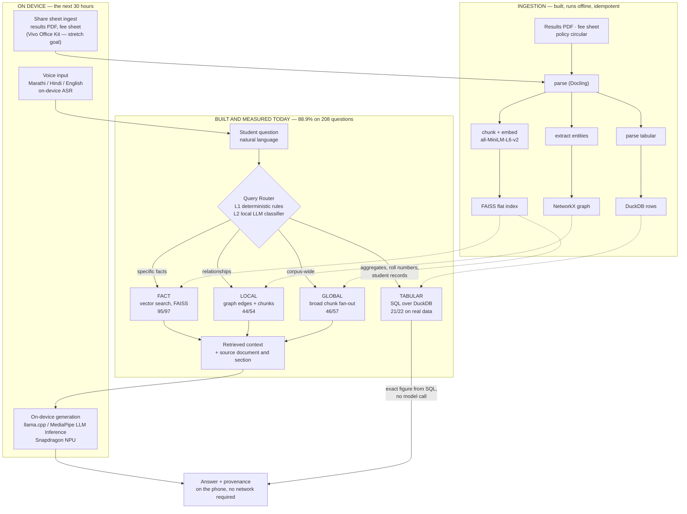

# Company Brain — iQOO Hackathon Submission

**Track: Smart Education** · Round 1

> **The engine is built, benchmarked, and beats two rival architectures on the same hardware.
> The 30 hours puts it on the phone's silicon.**

**One line:** Company Brain puts your college's own answers in your pocket — a student asks a
question in their own words, and four question types route to four different retrievers
(SQL for numbers, vector search for facts, a graph for relationships, corpus-wide fan-out for
overall questions), with the model running on the device so student records never leave it.

Every claim below is **measured and reproducible from the repo**, or marked as what the next
**30 hours** delivers. There is no third category.

---

## 1. Problem

A student's own record is the one document they cannot get an answer out of.

Today, the answer to *"do I have a backlog in DBMS?"*, *"am I eligible for the scholarship?"*
or *"what's the minimum attendance?"* reaches a student through one of three channels:

1. a **WhatsApp rumour** from a senior who half-remembers last year's rule,
2. a **queue outside the admin office**, during office hours, in person,
3. a **photo of a notice board** taken by whoever got there first.

The maddening part: **the institution already has every one of those answers.** They sit in a
results PDF, a fee sheet, an attendance register, a policy circular. The information exists; it
is not reachable from where the student is standing.

The scale: roughly **43,000 colleges and ~4 crore students** in Indian higher education (public
higher-education figures — not our measurement). Nearly all of those students carry a phone.
Almost none of them have an app that will answer a question about their own record.

**Why the cloud-first version never shipped.** Student records are PII, frequently minors' PII.
No college registrar pastes a results database into a cloud LLM, and no vendor can promise that
data won't be retained, logged, or trained on. Every cloud-first attempt at this product dies in
the same meeting.

That constraint is the product requirement, not an obstacle to route around. **The answer engine
runs on the device.**

---

## 2. Idea

**Company Brain**: your college's answers, in your pocket, running on your phone.

A student types or speaks a question in natural language. A router classifies what *kind* of
question it is and sends it to the store that answers it:

| Question the student asks | Route | What answers it |
|---|---|---|
| "How many students failed at least two subjects?" · "What's my SGPA?" | **TABULAR** | Parameterized SQL over DuckDB — an exact figure, computed, not recalled |
| "What is the minimum attendance requirement?" | **FACT** | Vector search over the policy corpus (FAISS) |
| "Who heads the department that runs the HPC lab?" | **LOCAL** | Knowledge-graph edges **plus** retrieved chunks |
| "Which department performs best overall?" | **GLOBAL** | Broad corpus-wide chunk fan-out |

The language model is used where it earns its place: entity extraction during ingestion, and
answer synthesis on the non-tabular routes. **A number the system reports came out of SQL** — a
computed value, not a model's recollection of a table.

The institution's side is equally direct: point it at the documents you already have. The
ingestion pipeline parses a results PDF or a fee sheet into structured rows, a vector index and a
knowledge graph, and is idempotent — a manifest of file hashes means re-running skips unchanged
files.

---

## 3. USP

**We beat two rival architectures on identical hardware, and we can show the receipts for every
point.**

Same corpus, same 4B local model, same 4 GB GPU, same frozen scorer, 208 questions:

| Architecture | Overall | FACT (97) | GLOBAL (57) | LOCAL (54) |
|---|---|---|---|---|
| Naive RAG — top-3 chunks, no routing | 62.5% | 88 | 34 | **8** |
| GraphRAG-style — community summaries + graph edges | 69.7% | 94 | 20 | 31 |
| **Company Brain** — routed, chunk fan-out + hybrid graph | **88.9%** | **95** | **46** | **44** |

**+26.4 points over naive RAG.** On multi-hop relational questions — where answering requires
following a relationship into a second document — **8/54 → 44/54, a 5.5× improvement**.

Four differentiators that are structural, not tuning:

| | |
|---|---|
| **Routing, not one pipe** | Four question shapes, four retrievers. Numbers come from SQL; relationships come from a graph; the model is never asked to do arithmetic it can look up. |
| **It knows when it doesn't know** | **20/20** correct abstention on unanswerable questions. It says "I don't have enough information" rather than inventing one. |
| **Runs in 4 GB** | RTX 2050 laptop, `num_ctx=2048`, **zero cloud calls** — enforced by a test (`tests/test_eval_no_egress.py`), not by a policy paragraph. |
| **Measured against its own worst case** | Score every answer against the *next* question's gold — the "artifact floor" — and a content-free answer earns 19.2%. Our 88.9% is **4.6×** that, so the gain is comprehension, not verbosity. |

**We grade ourselves harder than the judges will.** Two of our four candidate improvements were
rejected by our own pre-registered gates, one of them after it had already passed its first run
and then failed replication. That is the standard the 88.9% survived.

---

## 4. Working MVP / prototype status

### Shipped and measured

| Component | Evidence |
|---|---|
| Four-route retrieval engine + router + provenance on every answer | **88.9% on 208 questions** |
| Benchmark instrument: world model, validator, frozen scorer, replication gates | Rejected 15 of our own questions and 2 of our own 4 improvements |
| Ingestion: PDF → SQL rows + vector index + knowledge graph, idempotent | **369 students · 2,952 exam records · 12 policy documents** |
| FastAPI service (`/query`, `/upload`, `/documents`, `/review`, `/audit/*`) | Running |
| Next.js 16 operator dashboard, 7 screens incl. live audit stream | Running |
| Multi-tenant isolation, scoped API keys, path-traversal guards, PII controls | Isolation tests in the suite |
| 21-check production audit suite with 5 deployment-blocking gates | `audit/` + weighted scorecard |
| Telegram + WhatsApp delivery against the same API | `bots/` |
| Automated tests | **280 passing, 50 files** |
| Median end-to-end latency | **1.85 s** (4 GB laptop GPU) |

### Next 30 hours

| Component | Delivered as |
|---|---|
| Android client on the iQOO | Ask screen with the mic as the primary control, answer with its source document |
| On-device generation (Snapdragon NPU; llama.cpp / MediaPipe LLM Inference) | An adapter behind the generation interface that already exists |
| Marathi / Hindi voice input, answered on-device | Spoken question in, answer back in the language asked, aeroplane mode on |
| On-device accuracy | The same 208-question benchmark, same frozen scorer, re-run on the phone |
| Device performance | Tokens/sec, cold start, battery per 100 queries, peak RAM — measured and published |
| Vivo Office Kit share-sheet ingest | Designed; stretch goal past the 30-hour critical path |
| Input-classifier prompt-injection defence (see §12) | On the roadmap, after the device build |

Live proof of the engine, captured from the running system:
[`demo1-tabular.png`](../demo1-tabular.png) (SQL route, exact figures) ·
[`demo2-student-card.png`](../demo2-student-card.png) (student record) ·
[`demo3-multihop.png`](../demo3-multihop.png) (two-hop relational) ·
[`demo4-abstention.png`](../demo4-abstention.png) (it declines to invent an answer).

---

## 5. Team

**Rohan Gaikwad — Lead.**
Claude Hackathon — **National Winner (Rank 1), Claude Impact Labs, Mumbai**; selected for
**Claude for Startups**. **NASA OSDR contributor**. Built the retrieval engine, the benchmark harness, and the measurement
discipline behind every number in this document — including the gates that rejected two of his
own improvements.

- **66 public repositories · 3,044 contributions in the last year · GitHub Developer Program
  member**
- **Project Admin** at **GirlScript Summer of Code**, **Social Summer of Code**, and **Eliter
  Coders Winter of Code** — runs projects and mentors contributors through their first
  open-source commits
- **VishwaGuru** — open civic-tech platform using AI to help citizens contact representatives and
  file grievances; 12 stars, 41 forks, AGPL
- **FixingNation** — Flutter/Android app for civic grievance reporting to local authorities
- [github.com/RohanExploit](https://github.com/RohanExploit) ·
  [linkedin.com/in/rohanvijaygaikwad](https://linkedin.com/in/rohanvijaygaikwad) ·
  itzrohan007@gmail.com

**The Android half is inside demonstrated ability.** A shipped Flutter/Android app is already on
the record, so the device build is the same engineer doing a thing he has done, against an engine
he wrote, behind an interface he designed to be swapped.

**Priyanka Jadhav — Domain & Evaluation.**
Academic topper, YSPM's Yashoda Technical Campus; **Avishkar Innovation Program Zonal
Qualifier**. Owns the question set, the ground truth, and the student-side problem definition —
the questions in the benchmark are the questions students actually ask, and the golds are checked
against the corpus before they are allowed to score anything.

Two people, one engine, one instrument. The division is deliberate: the person who builds the
retriever does not get to decide alone what counts as a correct answer.

---

## 6. Usefulness & impact

**For the student.** The three channels in §1 — rumour, queue, notice board — are replaced by one
question box that answers from the college's own documents, at **1.85 s** median on hardware
weaker than the phone, with the source document cited. The abstention behaviour matters as much
as the accuracy: a system that answers "I don't have enough information" is one a student can
trust with a question about a backlog. **20/20** on that.

**For the institution.** The admin office stops being a lookup service. The same documents they
already produce — results PDF, fee sheet, policy circular — become the answer surface, with no
data migration and no new system of record. Ingestion is idempotent, so re-publishing a corrected
result PDF is a re-run.

**For the parent.** "Has the fee been paid, and what is still due" stops being a phone call
during office hours.

**Who this reaches.** Tier-2 and tier-3 colleges, which is most of the ~43,000. They have the
documents and the students; what they don't have is an IT budget for a cloud RAG contract with
per-query pricing. On-device inference makes the marginal cost of a student question **zero** —
the only shape of this product that reaches four crore people.

**What we have proven, precisely.** The architecture works, at 88.9% over 208 questions, on one
synthetic benchmark corpus with a 4B local model. The next corpus — scanned, OCR-noisy,
Marathi-annotated result sheets from a real college office — is the roadmap item after the phone,
and it will be measured the same way.

---

## 7. Scalability

**Per college, the footprint is small and flat.**

| Dimension | Today | Why it scales |
|---|---|---|
| Vector index | FAISS **flat** (`faiss.IndexFlatL2`) — a few MB per college *(exact size on a real college's corpus: measured during the device build)* | No GPU-resident ANN structure, no index server, nothing to shard |
| Structured records | DuckDB file — 369 students / 2,952 exam records in the current tenant | Single-file embedded database; opens read-only, fails closed if missing |
| Embeddings | `all-MiniLM-L6-v2`, ~90 MB, one model for every tenant | Loaded once per process and shared (`_MODEL_CACHE`) |
| Generation | 4B quantized model, `num_ctx=2048` | Fits the 4 GB budget; the same model serves every tenant |
| Tenancy | `data/tenants/<id>/` trees, scoped API keys, path-traversal guards, isolation tests | Adding a college is adding a directory, not provisioning infrastructure |

**The cost curve is the real scalability story.** A cloud-RAG deployment costs per query, forever,
and that cost scales with the number of students who dare to ask. On-device inference costs
nothing per query, so a large university and a small tier-3 college have identical unit economics.
The one thing that scales with college count is ingestion — batch, offline, and idempotent.

**Multi-tenant on the server side already works** (per-tenant stores, scoped keys, isolation
tests); the phone case is *single*-tenant by construction, which is strictly simpler: one
college's index, on one student's device.

---

## 8. Architecture

The engine as built today, extended with the phone lane the 30 hours adds.

**What the phone lane changes and what it does not.** The router, the four stores and the
provenance path are untouched — they are file-backed and CPU-bound. Two things become
device-native: the **generation backend** (an adapter behind the interface that already exists)
and the **input surface** (voice + share sheet). That is the whole port, and it is why 30 hours
is a real number.

### The router in detail

| Layer | Mechanism | Outcome |
|---|---|---|
| **L1 — deterministic** | Roll-number regex, student-record phrases, aggregate keywords, fact-attribute patterns | Direct `TABULAR` / `FACT` classification, **no model call** |
| **L2 — LLM classifier** | Local model classifies into FACT / LOCAL / GLOBAL / TABULAR | Engaged when L1 doesn't match |
| **L3 — retrieval** | Dispatch to the store for the chosen route | Context, or for TABULAR the final answer |

Three findings from measurement shaped this design, each against the obvious plan:

1. **Community summaries are worse than useless for corpus-wide questions.** Textbook GraphRAG
   "global search" scored **35.1%**; a broad chunk fan-out on the same questions scored **82.5%**.
   The summaries are generated from bare entity *names*, so they carry no figures, dates or
   sources — one of ours reads *"The entity '62' appears to be a single numerical value without
   contextual information."*
2. **Graph and vector retrieval fail in disjoint places, so we use both.** Chunks beat graph edges
   42/54 to 31/54, yet lost three questions *reproducibly* — two-hop questions whose second hop
   sits in a document the question's own wording never retrieves; one returned a confidently
   **wrong** department. The hybrid scores **44/54** and loses none of them.
3. **Fixing the router first would have made the product worse.** Route classification is 54.3%,
   an obvious target — but with the routes as originally built, *correct* routing scored **66.8%**
   against 80.8% for the sloppy router, because misrouting was accidentally rescuing questions.
   Repair the destinations first, and the same work becomes a gain.

---

## 9. Phone-first thinking

We did not build a server product and then wonder whether it could be shrunk. Every constraint
below was a design decision taken before the phone was on the table, because the privacy argument
in §1 always had one ending.

| Phone constraint | Decision already in the repo |
|---|---|
| **Generation must be swappable to a device runtime** | Generation lives behind one interface (`generation/answer.py`) with the backend chosen at call time. llama.cpp or MediaPipe LLM Inference is another adapter behind the same call — an integration, **not a rewrite**. |
| **The index must fit on the device** | FAISS **flat** index. No IVF/HNSW training, no index server, nothing that assumes a GPU or a datacentre. |
| **Embeddings must fit in app storage** | `all-MiniLM-L6-v2`, ~90 MB — chosen for size, and the only embedder in the system. |
| **Memory is the binding constraint** | The entire pipeline runs inside **4 GB VRAM** — the same order as a phone's LLM budget. `num_ctx` is 2048 at *every* call site behind a single knob (`config.OLLAMA_NUM_CTX`), because context length drives KV-cache size directly. |
| **Compute is battery** | L1 routing is deterministic regex/keyword rules that answer common shapes with **no model call at all**; the SQL template path is LLM-free end to end. |
| **The network may not exist** | Cloud egress defaults to **off** (`ALLOW_EXTERNAL_LLM=0`) and the evaluation path is **test-enforced** offline. Aeroplane mode is the default operating condition, not a demo trick. |
| **Privacy is architectural** | Per-tenant isolation, roll-number redaction available before any egress, no PII in git. On the phone this becomes the strongest version: one college's index, on one student's device, nothing leaves. |

We rejected a change *because* of the phone budget: raising the context window to 4096 was
**rejected at 55.5 s against a 60 s timeout**. A gain we could not afford on 4 GB is a gain we
certainly cannot afford on a handset.

---

## 10. Device performance

**Measured today, on a 4 GB laptop GPU (RTX 2050), 4B model, temperature 0:**

| Metric | Measured |
|---|---|
| Median end-to-end latency | **1.85 s** |
| Memory budget | **4 GB VRAM**, `num_ctx=2048` |
| Overall accuracy | **88.9%** (185/208) |
| Tabular accuracy on real data | **21/22 (95.5%)** |
| Cloud calls | **zero**, test-enforced |
| Deterministic routes | L1 rules + SQL templates answer with **no model call** |

**Measured on the iQOO during the build, and published:**

| Metric | When |
|---|---|
| On-device accuracy — the same 208 questions, same frozen scorer, only the hardware and inference backend change | Hours 22–26 |
| On-device tokens/sec (prompt-eval and generation reported separately) | Hours 22–26 |
| Cold start (app launch → first answer), cold and warm | Hours 22–26 |
| Battery per 100 queries | Hours 22–26 |
| Peak RAM on device | Hours 22–26 |
| Voice-path word error rate and latency (speech → answer) | Hours 22–26 |

We publish device numbers once we have run them on the device — that rule is what makes the
laptop numbers worth reading. The reference point is the table above: the iQOO's **12–16 GB of
RAM** and its NPU sit well clear of the **4 GB** budget the whole pipeline already fits inside.

---

## 11. On-device / local models

| Layer | Model | Where it runs |
|---|---|---|
| Generation | `qwen3:4b-instruct-2507-q4_K_M` — 4B params, Q4 quantized | Local today (Ollama, 4 GB VRAM); **on-device via llama.cpp / MediaPipe LLM Inference** in the next 30 hours |
| Embeddings | `all-MiniLM-L6-v2`, ~90 MB | Local today; ships inside the app |
| Retrieval | FAISS flat index, DuckDB, NetworkX graph | All file-backed, CPU-only, already portable |
| Routing (L1) | Deterministic rules — no model | Free, on any device |
| Voice (ASR) | Indian-language input, Marathi / Hindi | Ships in the next 30 hours, answered on-device |

**Zero cloud calls is a tested property, not a promise.** `tests/test_eval_no_egress.py` fails the
build if the evaluation path can reach a cloud model; `ALLOW_EXTERNAL_LLM` defaults to `0` in
`config.py`. The optional cloud fallback exists for a laptop operator who wants it, is off by
default, and can mask roll numbers before anything leaves the machine. The phone build has no
fallback path at all.

**Why a 4B model is the right target.** The whole system is built so the model does the least
possible work: numbers come from SQL, relationships come from graph edges, provenance comes from
the retriever. A 4B model handed the right context answers **95/97** FACT questions. Where its
ceiling shows is cross-document arithmetic — **14/24**, measured and isolated as its own
sub-metric, and headed for a compute step rather than a bigger model.

---

## 12. 30-hour build plan

**The promise: the iQOO answers a student's spoken Marathi or Hindi question about their own
record, in aeroplane mode, with the source document shown — and then we re-run the same
208-question benchmark on the device, with the same frozen scorer, so the on-device number is
directly comparable to the 88.9% we measured on a laptop.**

The block-by-block plan, with an owner, a definition of done and a pre-decided fallback for each,
is **[`docs/30_HOUR_PLAN.md`](30_HOUR_PLAN.md)**. In summary:

| Hours | Block | Done means |
|---|---|---|
| **0–3** | **Bring-up** — first token from a local model on the iQOO | Quantised model loads and completes a prompt, aeroplane mode on, decode speed logged |
| **3–8** | **The adapter** — on-device generation behind the existing `generate_answer()` interface | All four routes answer on device with provenance and abstention intact; ~20-question smoke set matched against the laptop |
| **8–13** | **Kill the server** — embeddings, FAISS-flat index, tabular store resident in the app | Four routes answering from device-local data with no network interface up |
| **13–18** | **Marathi / Hindi voice input**, answered on-device | ≥10 spoken questions per language answered end-to-end, in the language asked |
| **18–22** | **The student-facing app** | Ask screen with the mic as the primary control; the "I don't have enough information" state designed on purpose, not left as an error toast |
| **22–26** | **Measurement — the block we will not skip** | On-device accuracy on the 208-question benchmark, decode throughput, cold start, end-to-end latency, battery per 100 queries, voice word-error-rate |
| **26–29** | **Demo rehearsal + failure drill** | Three timed run-throughs on the real device; abstention rehearsed deliberately; recorded backup |
| **29–30** | **Buffer and submission** | Numbers proofread against the run logs; submitted, not "submitting" |

**The measurement block is pre-registered too.** If the full 208 will not finish on the device
inside its block, we run a **stratified subset fixed before we look at any result** — proportional
across FACT / GLOBAL / LOCAL, abstention questions included — and we run *the same subset on the
laptop* so the comparison stays apples-to-apples. We report it as a subset, with its size, and we
do not extrapolate it to 208.

**Our reporting rules for the demo, decided now rather than at hour 29:** every figure we show was
measured on the device it is attributed to; a subset is labelled a subset; and if the device
demands a smaller quantised model, we report that model's number next to the laptop 4B number and
name the gap rather than blurring it. Those rules are why our laptop numbers are worth trusting,
and they do not change under stage lights.

**Deliberately out of scope for these 30 hours** (full reasoning in `30_HOUR_PLAN.md`): router
classification (54.3%, worth close to zero accuracy points today), cross-document arithmetic (a
model-capability item, not an engineering one), the input-classifier injection defence, a native
iOS build, and any fine-tuning — because every number we have is comparable precisely by holding
the model, corpus and scorer fixed.

### Security, measured the same way as accuracy

Generation-layer prompt-injection hardening was implemented, **measured at −1.4 points (88.9% →
87.5%), and reverted.** The design that pays for itself is an input classifier ahead of
generation rather than instructions inside the generation prompt; it is item 3 on the roadmap
below. Hardening that shipped: a thread-safety fix in `retrieval/vector_search.py` (concurrent
queries could take the API down with a hard SIGSEGV; encoding is now serialised behind a lock)
and an empty-query guard at the API boundary. We measure security changes the way we measure
accuracy changes, and we report the result either way.

### What we measured that we haven't fixed yet

The remaining points are located, in cost order. That is what a measured system buys you.

1. **13 answers that were already retrieved.** Of 23 remaining failures, 18 are the system saying
   "I don't have enough information" — and in **13 of those the gold answer was sitting in the
   retrieved context**. A generation/prompt item, the largest single bucket, and the cheapest win
   on the board. Constraint: correct abstention is **20/20** today and stays there.
2. **Cross-document arithmetic, 14/24.** The fix is a compute step, not a bigger prompt. Scored as
   a separate sub-metric so it can never flatter the retrieval work.
3. **Prompt-injection defence via an input classifier** — the design above, with its own
   evaluation.
4. **Router classification, 54.3%.** Worth close to zero accuracy points today (forced-correct
   routing and live routing both score 88.9%), and worth latency and battery on the phone.
5. **A second corpus** — OCR noise, scanned PDFs, multilingual source documents, plus confidence
   intervals over repeated runs.

**The boundary of what we've measured**, stated up front so a follow-up question has an answer:
every accuracy figure comes from one synthetic benchmark corpus (30 documents, single domain,
English, clean text) and a 4B local model, at temperature 0, single-sample (GLOBAL varies ±2
questions between identical runs); and the "Naive RAG" and "GraphRAG-style" rows are **our
implementations** of those architectures on the same corpus, model and scorer — not Microsoft
GraphRAG, LangChain, LlamaIndex or any commercial platform. The harness is in the repo; adding a
competitor takes about twenty minutes.

---

## 13. Supporting links

| What | Where |
|---|---|
| **Repository + engineering README** | [`README.md`](../README.md) — architecture, run instructions, measured roadmap |
| **Verified metrics pack** | [`docs/PITCH_METRICS.md`](PITCH_METRICS.md) — every number and the command that produced it |
| **30-hour build plan** | [`docs/30_HOUR_PLAN.md`](30_HOUR_PLAN.md) — blocks, owners, definitions of done, pre-decided fallbacks |
| **Pitch narrative** | [`docs/pitch.md`](pitch.md) · [`docs/pitch.pdf`](pitch.pdf) · [`docs/pitch.pptx`](pitch.pptx) |
| **Reproduce the benchmark** | [`README.md` → Reproducing the benchmark](../README.md#reproducing-the-benchmark) — corpus, validator, run, score, compare |
| **Live screenshots** | [tabular / SQL](../demo1-tabular.png) · [student record](../demo2-student-card.png) · [two-hop relational](../demo3-multihop.png) · [correct abstention](../demo4-abstention.png) |
| **Performance runbook** | [`docs/PERFORMANCE.md`](PERFORMANCE.md) |
| **Lead** | [github.com/RohanExploit](https://github.com/RohanExploit) · [linkedin.com/in/rohanvijaygaikwad](https://linkedin.com/in/rohanvijaygaikwad) · itzrohan007@gmail.com |

---

Every accuracy figure in this document comes from the 208-question benchmark described in §8
and reproducible from the repository, on a 4B local model at 4 GB VRAM, temperature 0, with
answers frozen to disk before scoring. Device figures are measured during the 30-hour build and
published with it.
