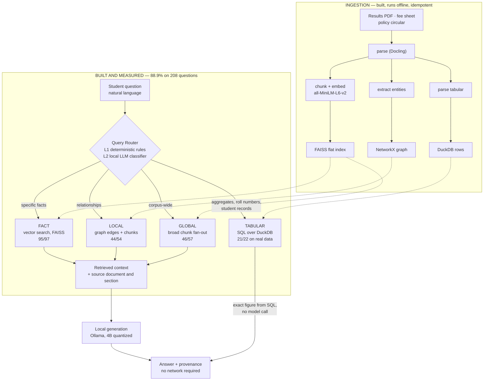

# Company Brain — problem, approach, and what is measured

Company Brain puts an institution's own answers within reach of the people who need
them. A student asks a question in their own words, and four question types route to
four different retrievers — SQL for numbers, vector search for facts, a graph for
relationships, corpus-wide fan-out for overall questions — with the model running
locally so student records never leave the institution.

Every claim below is measured and reproducible from the repository, or explicitly
marked as roadmap. There is no third category.

---

## 1. Problem

A student's own record is the one document they cannot get an answer out of.

Today, the answer to *"do I have a backlog in DBMS?"*, *"am I eligible for the
scholarship?"* or *"what's the minimum attendance?"* reaches a student through one of
three channels:

1. a **WhatsApp rumour** from a senior who half-remembers last year's rule,
2. a **queue outside the admin office**, during office hours, in person,
3. a **photo of a notice board** taken by whoever got there first.

The maddening part: **the institution already has every one of those answers.** They
sit in a results PDF, a fee sheet, an attendance register, a policy circular. The
information exists; it is not reachable from where the student is standing.

The scale: roughly **43,000 colleges and ~4 crore students** in Indian higher
education (public higher-education figures — not our measurement). Nearly all of those
students carry a phone. Almost none of them have a way to ask a question about their
own record.

**Why the cloud-first version never shipped.** Student records are PII, frequently
minors' PII. No college registrar pastes a results database into a cloud LLM, and no
vendor can promise that data won't be retained, logged, or trained on. Every
cloud-first attempt at this product dies in the same meeting.

That constraint is the product requirement, not an obstacle to route around. **The
answer engine runs locally.**

---

## 2. Idea

A student types or speaks a question in natural language. A router classifies what
*kind* of question it is and sends it to the store that answers it:

| Question the student asks | Route | What answers it |
|---|---|---|
| "How many students failed at least two subjects?" · "What's my SGPA?" | **TABULAR** | Parameterized SQL over DuckDB — an exact figure, computed, not recalled |
| "What is the minimum attendance requirement?" | **FACT** | Vector search over the policy corpus (FAISS) |
| "Who heads the department that runs the HPC lab?" | **LOCAL** | Knowledge-graph edges **plus** retrieved chunks |
| "Which department performs best overall?" | **GLOBAL** | Broad corpus-wide chunk fan-out |

The language model is used where it earns its place: entity extraction during
ingestion, and answer synthesis on the non-tabular routes. **A number the system
reports came out of SQL** — a computed value, not a model's recollection of a table.

The institution's side is equally direct: point it at the documents you already have.
The ingestion pipeline parses a results PDF or a fee sheet into structured rows, a
vector index and a knowledge graph, and is idempotent — a manifest of file hashes
means re-running skips unchanged files.

---

## 3. What makes it different

**Two rival architectures, beaten on identical hardware, with receipts for every
point.**

Same corpus, same 4B local model, same 4 GB GPU, same frozen scorer, 208 questions:

| Architecture | Overall | FACT (97) | GLOBAL (57) | LOCAL (54) |
|---|---|---|---|---|
| Naive RAG — top-3 chunks, no routing | 62.5% | 88 | 34 | **8** |
| GraphRAG-style — community summaries + graph edges | 69.7% | 94 | 20 | 31 |
| **Company Brain** — routed, chunk fan-out + hybrid graph | **88.9%** | **95** | **46** | **44** |

**+26.4 points over naive RAG.** On multi-hop relational questions — where answering
requires following a relationship into a second document — **8/54 → 44/54, a 5.5×
improvement**.

Four differentiators that are structural, not tuning:

| | |
|---|---|
| **Routing, not one pipe** | Four question shapes, four retrievers. Numbers come from SQL; relationships come from a graph; the model is never asked to do arithmetic it can look up. |
| **It knows when it doesn't know** | **20/20** correct abstention on unanswerable questions. It says "I don't have enough information" rather than inventing one. |
| **Runs in 4 GB** | RTX 2050 laptop, `num_ctx=2048`, **zero cloud calls** — enforced by a test (`tests/test_eval_no_egress.py`), not by a policy paragraph. |
| **Measured against its own worst case** | Score every answer against the *next* question's gold — the "artifact floor" — and a content-free answer earns 19.2%. Our 88.9% is **4.6×** that, so the gain is comprehension, not verbosity. |

Two of four candidate improvements were rejected by our own pre-registered gates, one
of them after it had already passed its first run and then failed replication. That is
the standard the 88.9% survived.

---

## 4. Usefulness and impact

**For the student.** The three channels in §1 — rumour, queue, notice board — are
replaced by one question box that answers from the institution's own documents, at
**1.85 s** median, with the source document cited. The abstention behaviour matters as
much as the accuracy: a system that answers "I don't have enough information" is one a
student can trust with a question about a backlog. **20/20** on that.

**For the institution.** The admin office stops being a lookup service. The same
documents they already produce — results PDF, fee sheet, policy circular — become the
answer surface, with no data migration and no new system of record. Ingestion is
idempotent, so re-publishing a corrected result PDF is a re-run.

**For the parent.** "Has the fee been paid, and what is still due" stops being a phone
call during office hours.

**Who this reaches.** Tier-2 and tier-3 colleges, which is most of the ~43,000. They
have the documents and the students; what they don't have is an IT budget for a cloud
RAG contract with per-query pricing. Local inference makes the marginal cost of a
student question **zero** — the only shape of this product that reaches four crore
people.

**What has been proven, precisely.** The architecture works, at 88.9% over 208
questions, on one benchmark corpus with a 4B local model. The next corpus — scanned,
OCR-noisy, Marathi-annotated result sheets from a real college office — is a roadmap
item, and it will be measured the same way.

---

## 5. Scalability

**Per institution, the footprint is small and flat.**

| Dimension | Today | Why it scales |
|---|---|---|
| Vector index | FAISS **flat** (`faiss.IndexFlatL2`) — a few MB per institution | No GPU-resident ANN structure, no index server, nothing to shard |
| Structured records | DuckDB file — 369 students / 2,952 exam records in the current tenant | Single-file embedded database; opens read-only, fails closed if missing |
| Embeddings | `all-MiniLM-L6-v2`, ~90 MB, one model for every tenant | Loaded once per process and shared (`_MODEL_CACHE`) |
| Generation | 4B quantized model, `num_ctx=2048` | Fits the 4 GB budget; the same model serves every tenant |
| Tenancy | `data/tenants/<id>/` trees, scoped API keys, path-traversal guards, isolation tests | Adding an institution is adding a directory, not provisioning infrastructure |

**The cost curve is the real scalability story.** A cloud-RAG deployment costs per
query, forever, and that cost scales with the number of students who dare to ask.
Local inference costs nothing per query, so a large university and a small tier-3
college have identical unit economics. The one thing that scales with institution
count is ingestion — batch, offline, and idempotent.

**Multi-tenant on the server side already works** (per-tenant stores, scoped keys,
isolation tests).

---

## 6. Architecture

### The router in detail

| Layer | Mechanism | Outcome |
|---|---|---|
| **L1 — deterministic** | Roll-number regex, student-record phrases, aggregate keywords, fact-attribute patterns | Direct `TABULAR` / `FACT` classification, **no model call** |
| **L2 — LLM classifier** | Local model classifies into FACT / LOCAL / GLOBAL / TABULAR | Engaged when L1 doesn't match |
| **L3 — retrieval** | Dispatch to the store for the chosen route | Context, or for TABULAR the final answer |

Three findings from measurement shaped this design, each against the obvious plan:

1. **Community summaries are worse than useless for corpus-wide questions.** Textbook
   GraphRAG "global search" scored **35.1%**; a broad chunk fan-out on the same
   questions scored **82.5%**. The summaries are generated from bare entity *names*, so
   they carry no figures, dates or sources — one of ours reads *"The entity '62'
   appears to be a single numerical value without contextual information."*
2. **Graph and vector retrieval fail in disjoint places, so we use both.** Chunks beat
   graph edges 42/54 to 31/54, yet lost three questions *reproducibly* — two-hop
   questions whose second hop sits in a document the question's own wording never
   retrieves; one returned a confidently **wrong** department. The hybrid scores
   **44/54** and loses none of them.
3. **Fixing the router first would have made the product worse.** Route classification
   is 54.3%, an obvious target — but with the routes as originally built, *correct*
   routing scored **66.8%** against 80.8% for the sloppy router, because misrouting was
   accidentally rescuing questions. Repair the destinations first, and the same work
   becomes a gain.

---

## 7. Security, measured the same way as accuracy

Generation-layer prompt-injection hardening was implemented, **measured at −1.4 points
(88.9% → 87.5%), and reverted.** The design that pays for itself is an input classifier
ahead of generation rather than instructions inside the generation prompt; it is on the
roadmap below. Hardening that shipped: a thread-safety fix in
`retrieval/vector_search.py` (concurrent queries could take the API down with a hard
SIGSEGV; encoding is now serialised behind a lock) and an empty-query guard at the API
boundary. Security changes are measured the way accuracy changes are, and the result is
reported either way.

---

## 8. What has been measured and not yet fixed

The remaining points are located, in cost order. That is what a measured system buys
you.

1. **13 answers that were already retrieved.** Of 23 remaining failures, 18 are the
   system saying "I don't have enough information" — and in **13 of those the gold
   answer was sitting in the retrieved context**. A generation/prompt item, the largest
   single bucket, and the cheapest win on the board. Constraint: correct abstention is
   **20/20** today and stays there.
2. **Cross-document arithmetic, 14/24.** The fix is a compute step, not a bigger
   prompt. Scored as a separate sub-metric so it can never flatter the retrieval work.
3. **Prompt-injection defence via an input classifier** — the design above, with its
   own evaluation.
4. **Router classification, 54.3%.** Worth close to zero accuracy points today
   (forced-correct routing and live routing both score 88.9%).
5. **A second corpus** — OCR noise, scanned PDFs, multilingual source documents, plus
   confidence intervals over repeated runs.

**The boundary of what has been measured**, stated up front so a follow-up question has
an answer: every accuracy figure comes from one benchmark corpus (30 documents, single
domain, English, clean text) and a 4B local model, at temperature 0, single-sample
(GLOBAL varies ±2 questions between identical runs); and the "Naive RAG" and
"GraphRAG-style" rows are **our implementations** of those architectures on the same
corpus, model and scorer — not Microsoft GraphRAG, LangChain, LlamaIndex or any
commercial platform. The harness is in the repo; adding a competitor takes about twenty
minutes.

---

## Further reading

| What | Where |
|---|---|
| Repository + engineering README | [`README.md`](../README.md) |
| Verified metrics pack | [`docs/PITCH_METRICS.md`](PITCH_METRICS.md) — every number and the command that produced it |
| Pitch narrative | [`docs/pitch.md`](pitch.md) |
| Reproduce the benchmark | [`README.md` → Reproducing the benchmark](../README.md#reproducing-the-benchmark) |
| Performance runbook | [`docs/PERFORMANCE.md`](PERFORMANCE.md) |
| Demo runbook | [`docs/DEMO_RUNBOOK.md`](DEMO_RUNBOOK.md) |

Every accuracy figure in this document comes from the 208-question benchmark
described in §6 and reproducible from the repository, on a 4B local model at 4 GB VRAM,
temperature 0, with answers frozen to disk before scoring.
