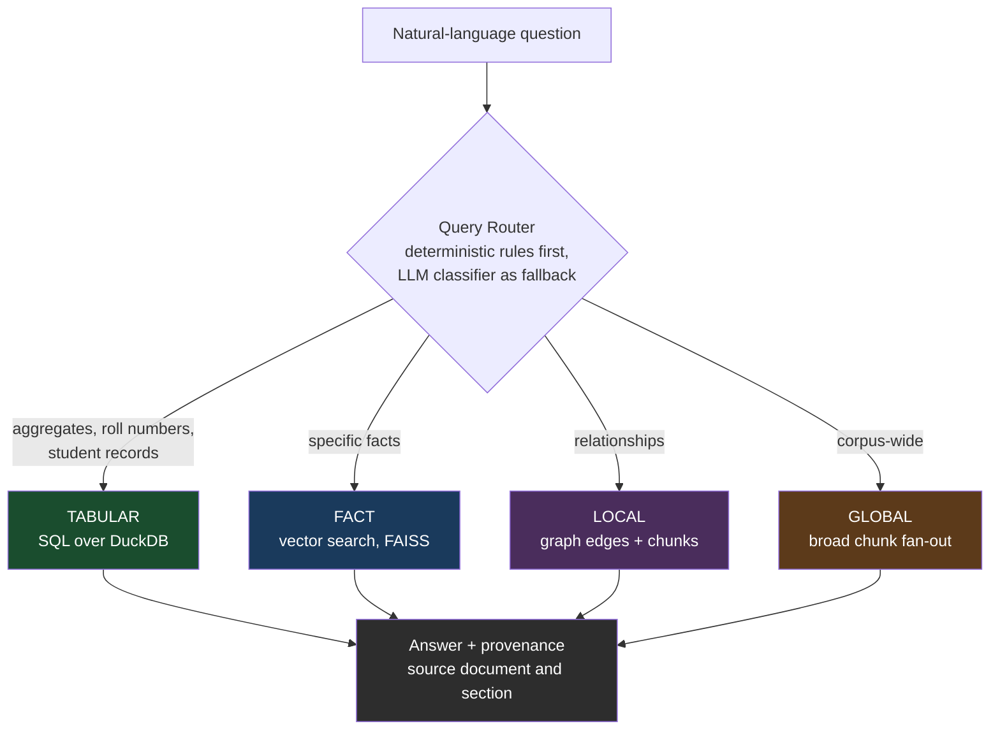
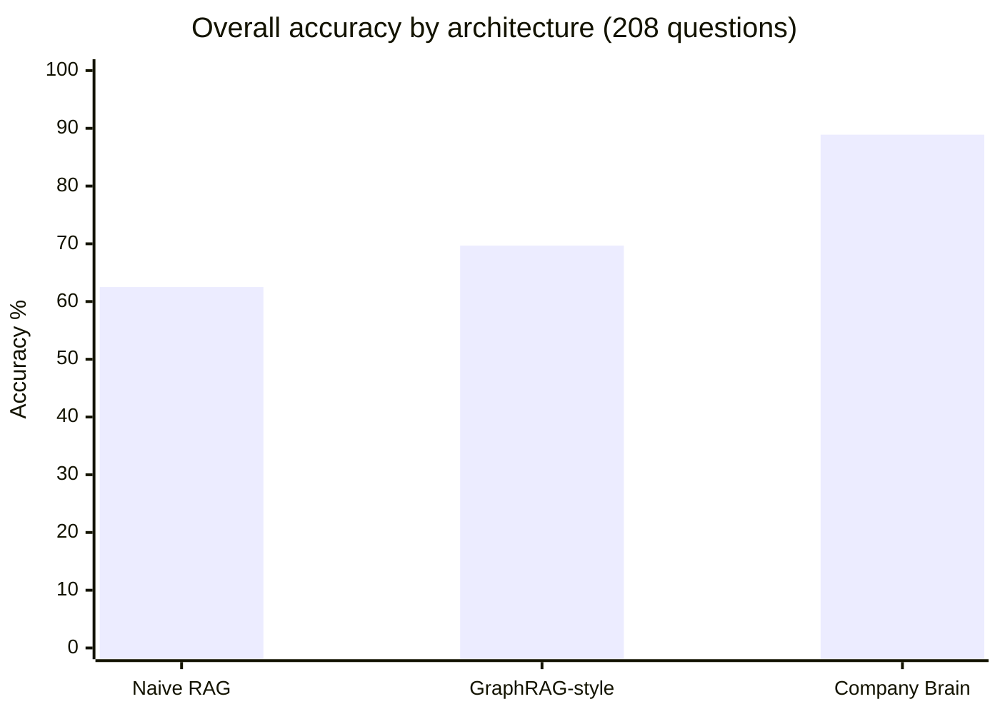
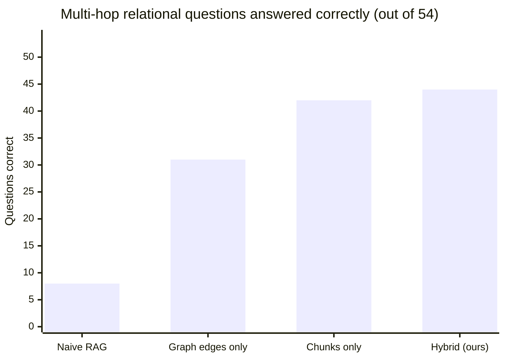
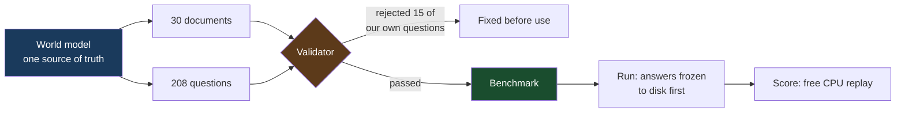

# Company Brain

## Ask your institution's data anything. On a laptop. Offline.

A multi-tenant retrieval system that answers natural-language questions over student
records, research documents and institutional policy — running entirely on a **4 GB laptop
GPU** with **zero cloud calls**, and scoring **88.9%** on a 208-question benchmark.

**Rohan Gaikwad** · [github.com/RohanExploit/startup-research-rag](https://github.com/RohanExploit/startup-research-rag) · itzrohan007@gmail.com

---

# The problem

An institution's answers are scattered across four incompatible shapes of data:

- **Spreadsheets and result PDFs** — "how many students failed at least two subjects?"
- **Policy documents** — "what is the minimum attendance requirement?"
- **Relationships between things** — "who heads the department that runs the HPC lab?"
- **The whole corpus at once** — "which department performs best overall?"

Standard RAG treats all four identically: embed everything, retrieve the top few chunks,
hope the model figures it out. We measured that approach on our benchmark. It scores
**62.5%**, and on relational multi-hop questions it collapses to **8 out of 54**.

Meanwhile the obvious alternative — sending everything to a cloud LLM — means student
records leave the building. For an institution handling minors' academic data, that is
often not a trade that can be made at any price.

---

# What we built

Four specialised routes behind one deterministic router. Each question goes to the store
that can actually answer it, and the LLM is used only where it adds value.

**Why routing matters:** numeric answers come from SQL, not from a language model's
recollection. Ask "how many students failed at least two subjects" and the system executes
a parameterised query and returns the exact figure. It cannot hallucinate a number it
computed.

---

# Results

Same corpus, same 4B local model, same 4 GB GPU, same frozen scorer, 208 questions.

| Architecture | Overall | FACT (97) | GLOBAL (57) | LOCAL (54) |
|---|---|---|---|---|
| Naive RAG — top-3 chunks, no routing | 62.5% | 88 | 34 | **8** |
| GraphRAG-style — community summaries + graph edges | 69.7% | 94 | 20 | 31 |
| **Company Brain** | **88.9%** | **95** | **46** | **44** |

**+26.4 points over naive RAG.** On multi-hop relational questions — the hardest class,
where an answer requires following a relationship across two documents — we go from
**8/54 to 44/54, a 5.5× improvement.**

---

# Beyond the headline number

| Property | Measured | Why it matters |
|---|---|---|
| **Abstains correctly** | **20/20** | Asked something the corpus cannot answer, it says so. It does not invent. |
| **Tabular accuracy** | **21/22 (95.5%)** | Real institutional data. Exact figures via SQL. |
| **Median latency** | **1.85 s** | End-to-end, on a consumer laptop GPU. |
| **Artifact floor** | 19.2% | A content-free answer scores 19.2%. We score **4.6× that.** |
| **Provenance** | every answer | Source document and section returned with the answer. |
| **Automated tests** | **280 passing** | 50 files, including tests that test the benchmark itself. |
| **Cloud calls** | **zero** | Enforced by a test, not by a policy document. |

---

# Three findings that changed the design

Each contradicted the obvious plan. Each came from measurement, not intuition.

**1. Community summaries are worse than useless for corpus-wide questions.**
The textbook GraphRAG approach — summarise entity clusters, answer from the summaries —
scored **35.1%**. The same questions answered from a broad chunk fan-out scored **82.5%**.
Those summaries are generated from bare entity *names*, so they contain no figures, dates
or sources. One of ours literally read: *"The entity '62' appears to be a single numerical
value without contextual information."*

**2. Graph and vector retrieval fail in different places, so we use both.**
Chunks beat graph edges 42/54 to 31/54 — but lost three questions *reproducibly*, all
two-hop questions whose second hop sat in a document the question's own wording never
retrieved. One returned a confidently **wrong** department. The hybrid scores **44/54** and
loses none of them.

**3. Fixing the router first would have made the product worse.**
Route classification is 54.3%, an obvious target. But with the routes as originally built,
*correct* routing scored **66.8%** against 80.8% for the sloppy router — misrouting was
accidentally rescuing questions. Repair the destinations first, and the same work becomes
a gain.

---

# How we know the numbers are real

Most RAG demos are scored on questions written after seeing the answers. Ours are not.

- **Golds cannot disagree with the corpus.** One world model renders both the documents and
  the questions.
- **Multi-hop questions are proven multi-hop.** The validator locates the bridge entity and
  the answer in *disjoint* documents. A question labelled multi-hop cannot be a lookup in
  disguise.
- **The validator rejected 15 of our own questions** before they shipped.
- **Answers are frozen before scoring**, so no scorer can be written after seeing the
  numbers it judges.
- **Every improvement was pre-registered** and had to pass a statistical rule on **two
  independent runs**.

## We publish what failed

| Candidate improvement | Verdict |
|---|---|
| GLOBAL chunk fan-out | **ACCEPTED** — passed both runs |
| LOCAL hybrid context | **ACCEPTED** — passed both runs |
| LOCAL vector-only | **REJECTED** — passed run 1, failed replication |
| Larger context window (4096) | **REJECTED** — 55.5 s latency vs a 60 s timeout |

**Two of four candidates were rejected by our own gates**, including one that passed its
first run and failed its replication. A team that never reports a negative result has
either been extraordinarily lucky or is not looking.

---

# Built for institutions, not demos

| | |
|---|---|
| **Runs on 4 GB VRAM** | RTX 2050 laptop. No A100, no cloud bill, no per-query cost. |
| **Offline by default** | `ALLOW_EXTERNAL_LLM=0`. Student data never leaves the machine. |
| **Multi-tenant** | Per-tenant data trees, scoped API keys, path-traversal guards, isolation tests. |
| **PII controls** | Vector-index PII guard; a role gate for student identities, built and tested, shipping OFF because who may see names is an institution's policy decision. |
| **Operator dashboard** | Next.js console: query, health, documents, review queue, upload, live audit stream. |
| **Chat delivery** | Telegram and WhatsApp bots against the same API. |
| **Production audit** | 21 checks — integrity, hallucination, prompt injection, RBAC — with 5 deployment-blocking gates. |

**Stack:** FastAPI · DuckDB · FAISS · NetworkX · sentence-transformers · Ollama
(`qwen3:4b`) · Next.js 16 · Python 3.12

---

# Where we go next

The remaining gap is well-characterised, which is the useful kind of gap.

- **23 failures left.** 18 are the system saying "I don't have enough information" — and in
  **13 of those the answer was sitting in the retrieved context.** That is a prompt problem,
  not a retrieval problem, and it is the cheapest remaining win.
- **Cross-document arithmetic is 14/24.** A 4B model quotes a table accurately and adds two
  of them together unreliably. A compute step or a larger model closes this.
- **Router accuracy is 54.3%** — and now worth roughly zero accuracy points, because both
  destination routes were repaired. It still matters for latency and cost.

**Honest scope:** these numbers come from one synthetic benchmark corpus, a 4B local model,
and single-sample runs. We have benchmarked *architectures* — naive RAG and a GraphRAG-style
design, both implemented by us — not commercial products. The harness is in the repo and
adding a competitor takes about twenty minutes.

---

# Company Brain

**Rohan Gaikwad**

[github.com/RohanExploit/startup-research-rag](https://github.com/RohanExploit/startup-research-rag)
itzrohan007@gmail.com

*88.9% on 208 questions. 4 GB GPU. Zero cloud calls. 280 tests. Every number reproducible
from a clean checkout.*
